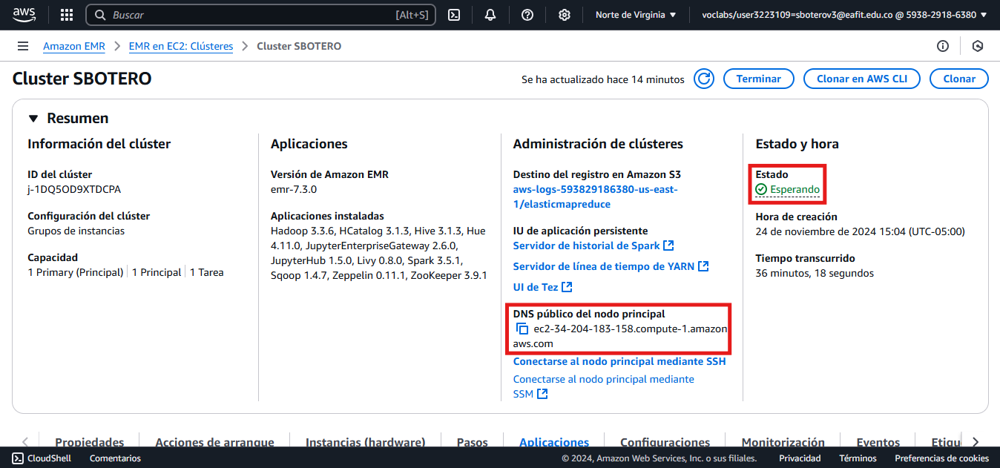
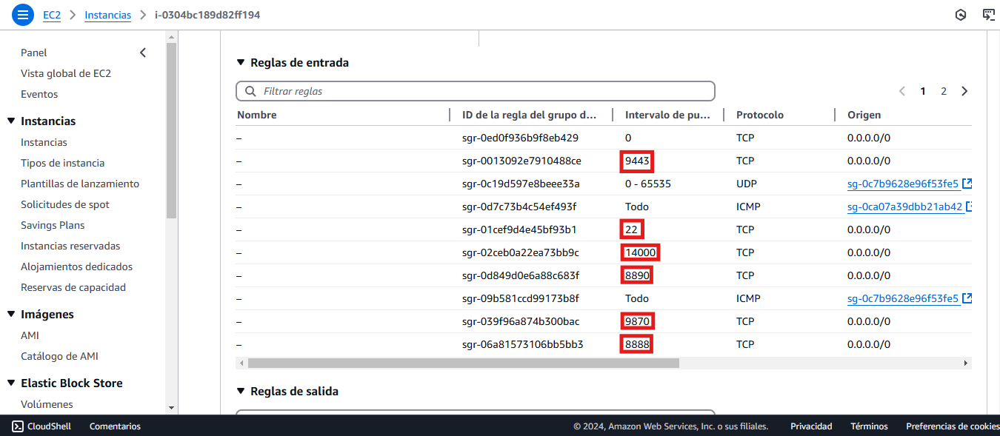

# Lab 0 AWS EMR

## 1. AWS EMR
AWS Elastic MapReduce (EMR) es un servicio que facilita el procesamiento y análisis de grandes volúmenes de datos utilizando frameworks de código abierto como Apache Hadoop, Apache Spark, Presto, HBase, y más. AWS EMR simplifica la creación, configuración y administración de clústeres relacionados con el manejos de datos, como análisis, transformación, machine learning y ETL.

El servicio permite procesar datos almacenados en Amazon S3, DynamoDB, o incluso bases de datos locales, ofreciendo escalabilidad automática para ajustar los recursos a las necesidades de la carga de trabajo.

EMR es ideal para empresas que necesitan analizar grandes cantidades de datos. Se integra de manera fluida con otros servicios de AWS, como Redshift y Athena, para crear soluciones completas de análisis de datos en la nube.

## 2. Implementación

Para la creación del clúster en AWS, se siguieron los pasos de la [guía.](https://github.com/st0263eafit/st0263-242/tree/main/bigdata/00-lab-aws-emr)

### 2.1. Creación del Clúster

### 2.2. Creación del Bucket

### 2.3. Agregar puertos

### 2.4. Ingreso a Hue

### 2.5. Ingreso Jupyter Hub (comprobación de variables)

