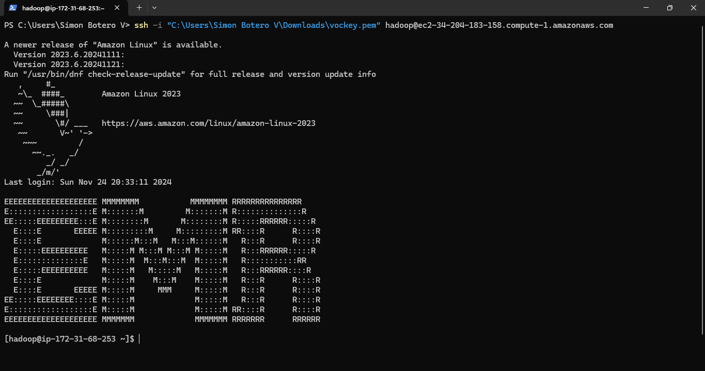
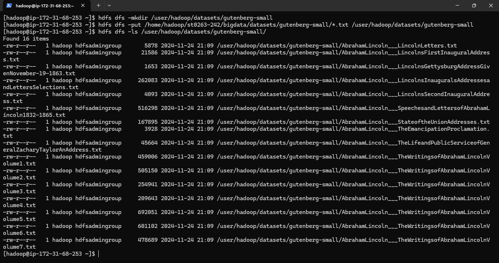
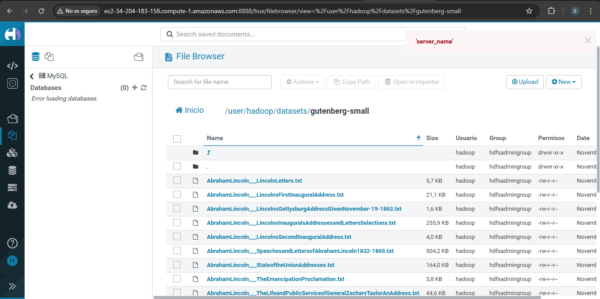
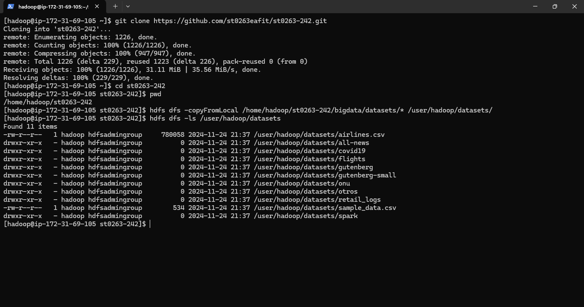
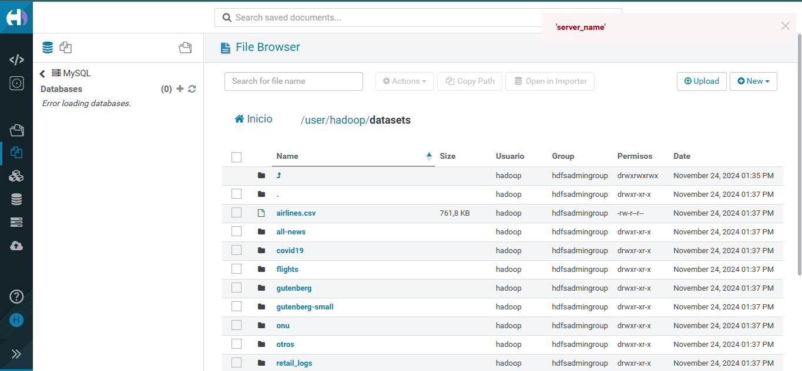
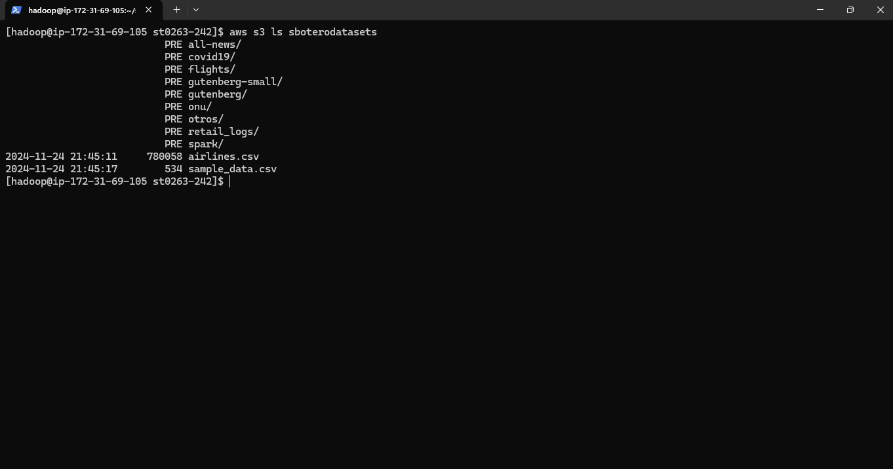
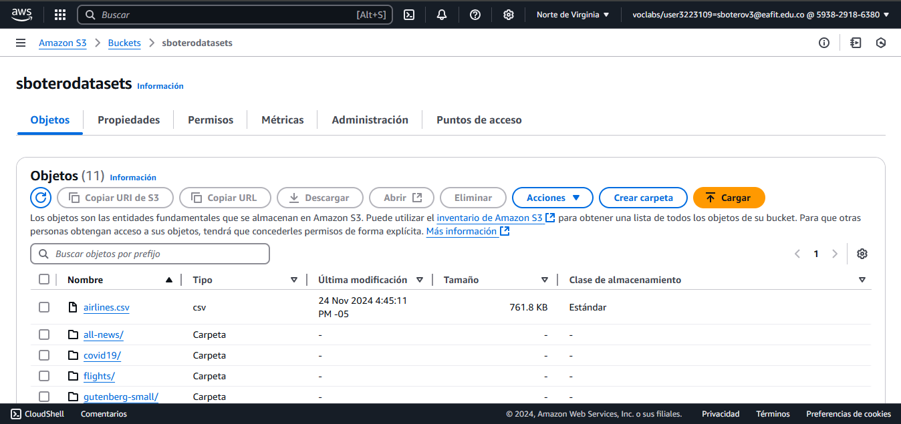
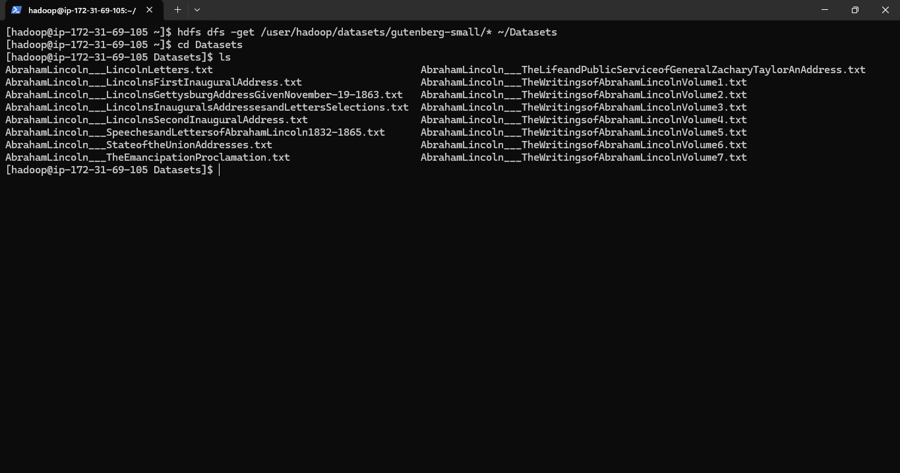

# Lab 1 HDFS

## 1. HDFS
HDFS es un sistema de archivos distribuido diseñado para almacenar grandes volúmenes de datos en clústeres. Está optimizado para manejar grandes archivos de datos, proporcionando alta escalabilidad, fiabilidad y rendimiento.
El Name Node, Data Node y Cliente interactúan entre si para el manejo de los datos. 

HDFS es ideal para almacenar y procesar grandes cantidades de datos de forma eficiente en entornos distribuidos.

## 2. Implementación
Se hizo los pasos establecidos en la [guía.](https://github.com/st0263eafit/st0263-242/tree/main/bigdata/01-hdfs)

## 2.1. Conexión mediante SSH


## 2.2. Guttenberg-Small

### 2.2.1. Subir y listar archivos en consola


### 2.2.2. Verificar en Hue


## 2.3. Copiar datasets en Hue

### 2.3.1.  Subir y listar archivos en consola


### 2.3.2. Verificar en Hue


## 2.4. Subir datasets de Hadoop a S3

El bucket para almacenar los datasets fue creado desde AWS y se llama *sboterodatasets*. Como anteriormente, se subieron todos los datasets a Hadoop, con este comando, se suben todos los datasets al bucket instanciado. 

```bash
hadoop distcp /user/hadoop/datasets/* s3a://sboterodatasets/
```

### 2.4.1.  Subir y listar archivos en consola


### 2.4.2. Verificar en AWS


### 2.5. Copiar archivos a local
