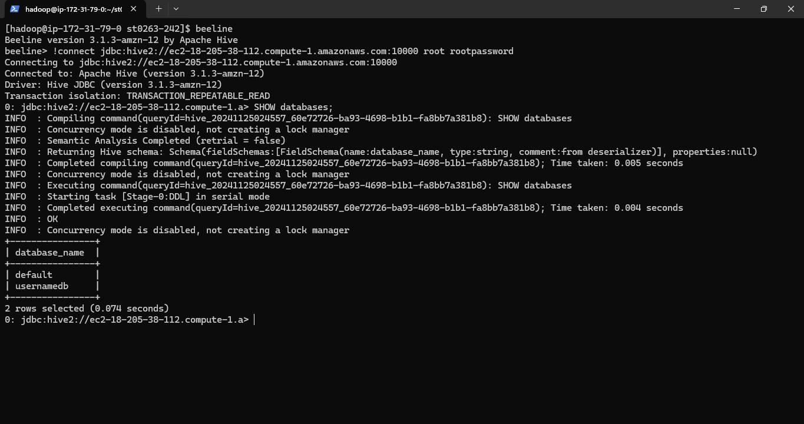
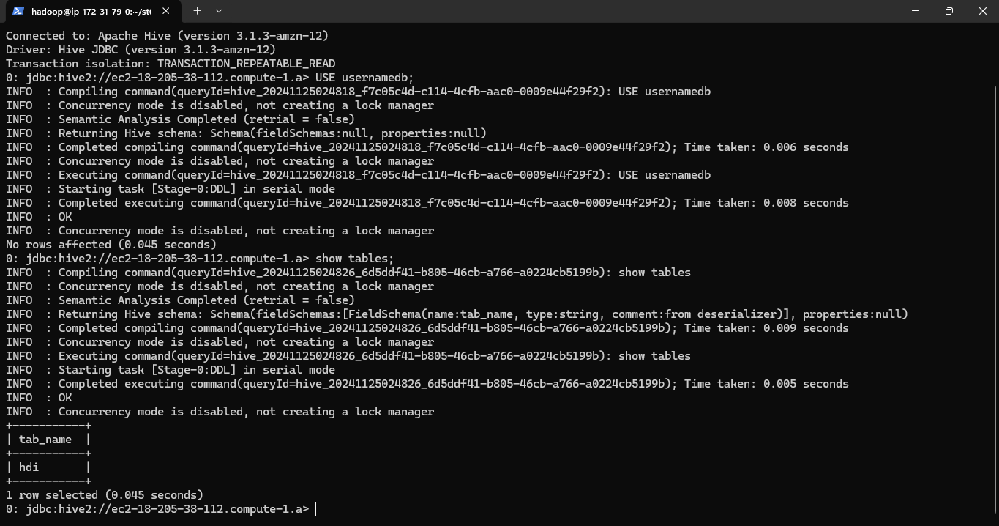
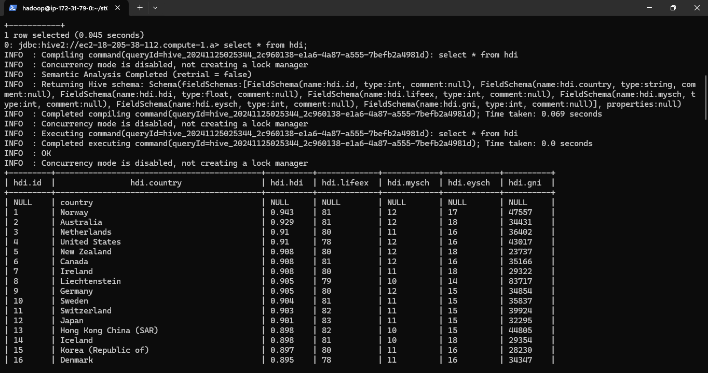
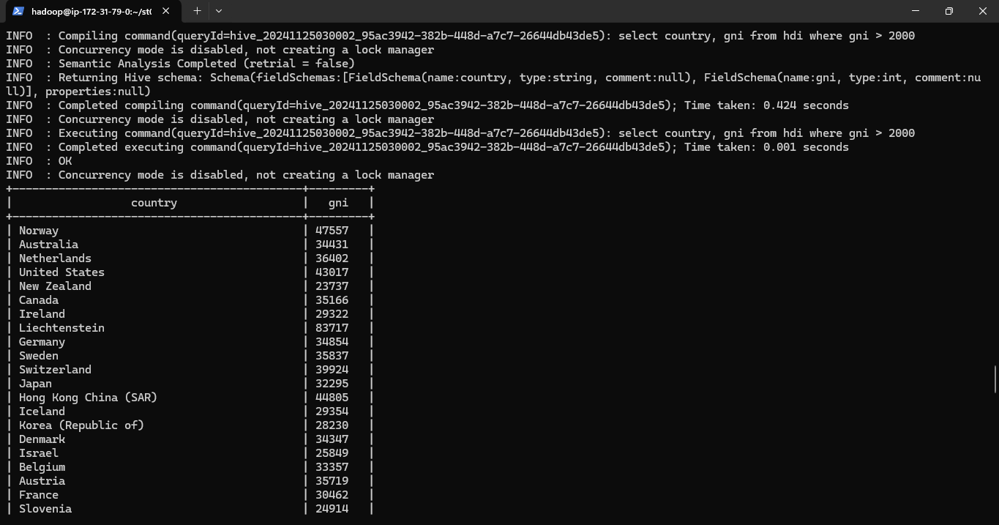
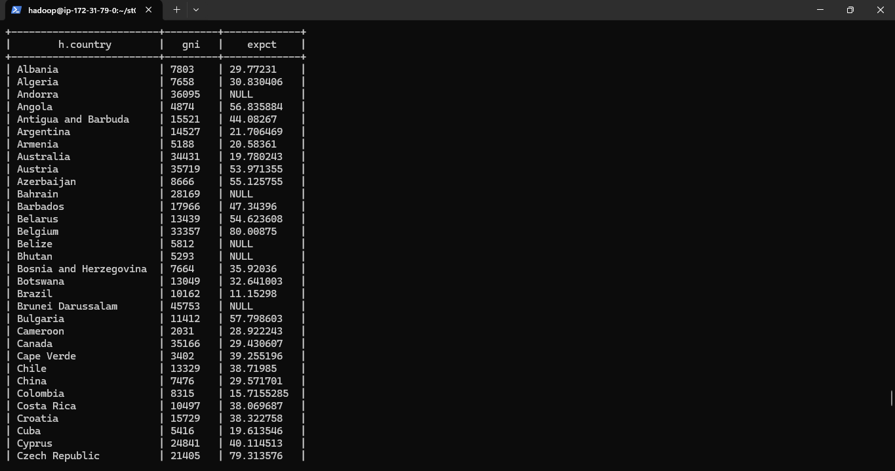
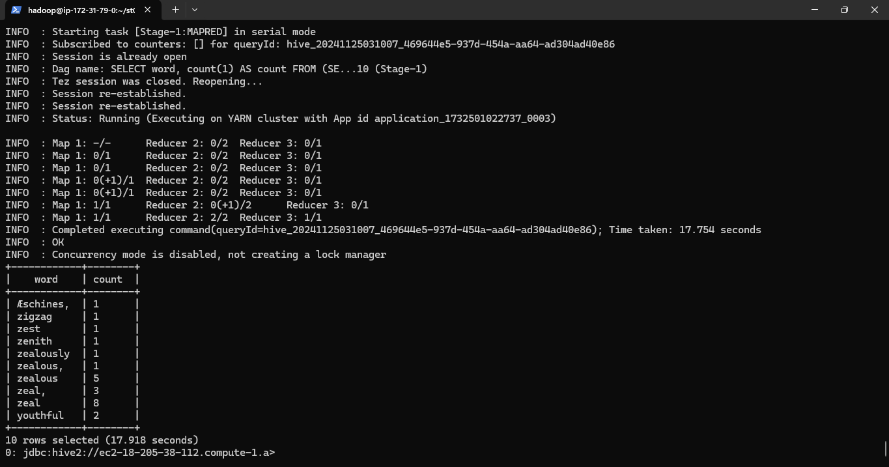
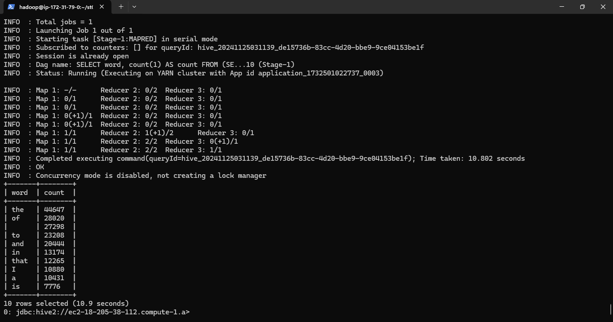

# Lab 2 Hive-SparkSQL

# 1. Hive y SparkSQL

# 2. Implementación

Se hizo los pasos establecidos en la [guía.](https://github.com/st0263eafit/st0263-242/tree/main/bigdata/03-hive-sparksql)

## 2.1. Conexión a Beeline

Se ingresea el comando:
```bash
beeline
```

Luego, conectarse a la DB:
```bash
!connect jdbc:hive2://ec2-18-205-38-112.compute-1.amazonaws.com:10000 root rootpassword`
```

## 2.2. Crear DB y tabla
```bash
CREATE databese usernamedb;
```



```bash
USE usernamedb;
CREATE TABLE HDI (id INT, country STRING, hdi FLOAT, lifeex INT, mysch INT, eysch INT, gni INT);
ROW FORMAT DELIMITED FIELDS TERMINATED BY ',';
STORED AS TEXTFILE;
```



### 2.3. Subir datos a la tabla

Primero, dar permisos al directorio:

```bash
hdfs dfs -chmod -R 777 /user/hadoop/datasets/onu/
```

Luego, conectarse a Beeline como se menciona anteriormente.

Finalmente, carga la información:

```bash
LOAD DATA INPATH '/user/hadoop/datasets/onu/hdi-data.csv' INTO TABLE HDI
```



### 2.4. Consulta



### 2.5. Join

Después de ejecutar estos comandos en **Beeline**:

```bash
CREATE EXTERNAL TABLE EXPO (country STRING, expct FLOAT) 
ROW FORMAT DELIMITED FIELDS TERMINATED BY ',' 
STORED AS TEXTFILE 
LOCATION 's3://sboterodatasets/onu/export/'
```

Se obtiene lo siguiente:


### 2.6. Ordenar por palabras



### 2.6. Ordenar por palabras



