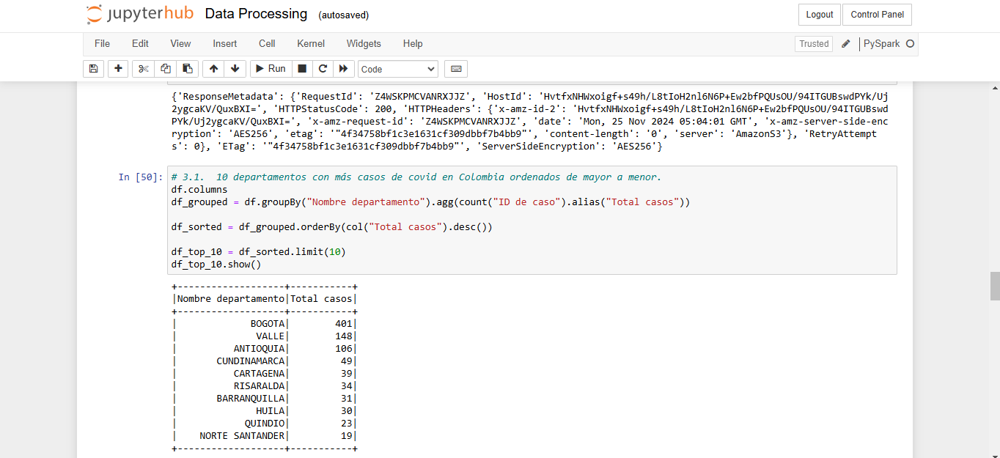
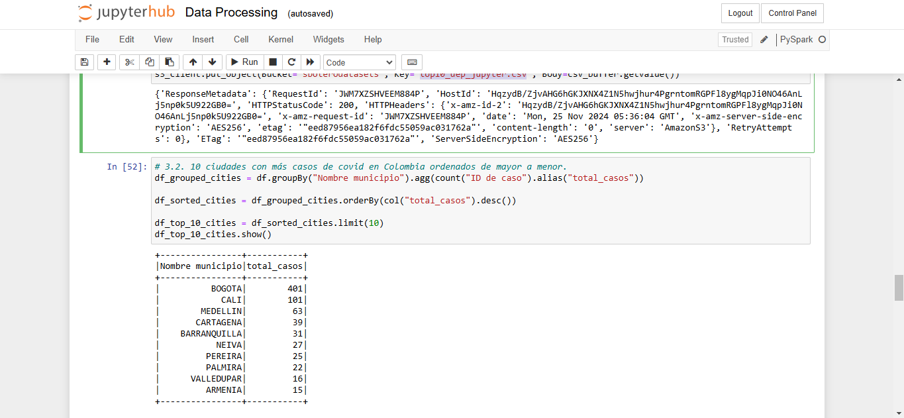
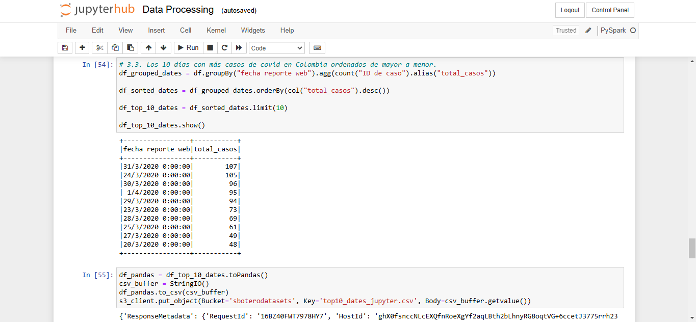
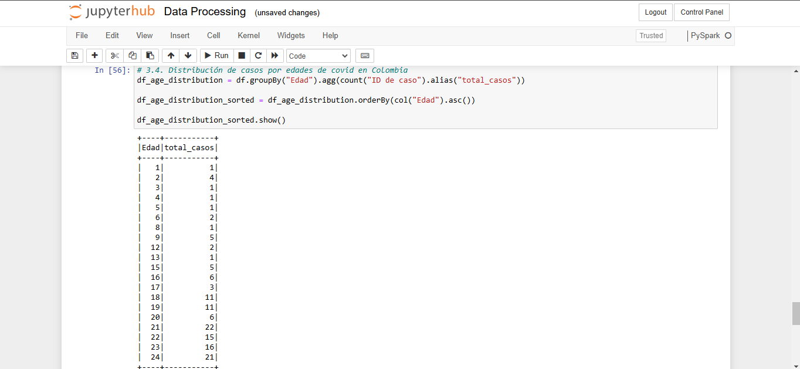
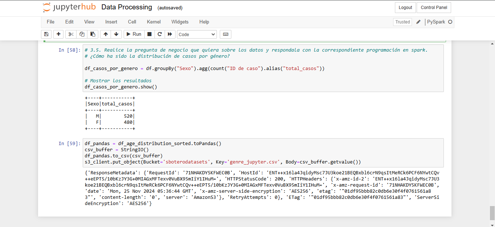

# Lab 3 Spark

# 1. Spark y PySpark
PySpark es la interfaz de Python para Apache Spark, que permite a los usuarios programar en Python y aprovechar las potentes capacidades de procesamiento de datos distribuidos de Spark. Con PySpark, puedes realizar procesamiento de grandes volúmenes de datos de manera eficiente utilizando el mismo motor distribuido subyacente que Apache Spark, pero en un entorno Python.

# 2. Implemantación 

## 2.1. Análisis exploratorio de datos
Ver archivo *covid_jupyter.csv* en el bucket *sboterodatasets*

## 2.2. Preguntas de negocio

### 2.2.1. Los 10 departamentos con más casos de covid en Colombia ordenados de mayor a menor.
Ver archivo *top10_dep_jupyter.csv* en el bucket *sboterodatasets*

### 2.2.2. Las 10 ciudades con más casos de covid en Colombia ordenados de mayor a menor.
Ver archivo *top10_ciu_jupyter.csv* en el bucket *sboterodatasets*

### 2.2.3. Los 10 días con más casos de covid en Colombia ordenados de mayor a menor.
Ver archivo *top10_days_jupyter.csv* en el bucket *sboterodatasets*

### 2.2.4. Distribución de casos por edades de covid en Colombia.
Ver archivo *age_distribution_jupyter.csv* en el bucket *sboterodatasets*

### 2.2.5. Distribución de casos por genéro.
Ver archivo *genre_jupyter.csv* en el bucket *sboterodatasets*

