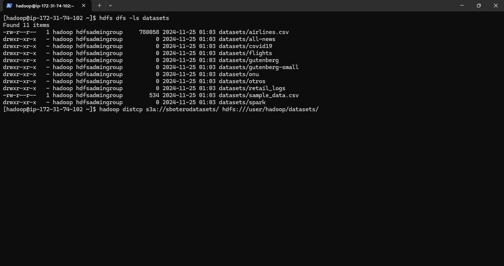
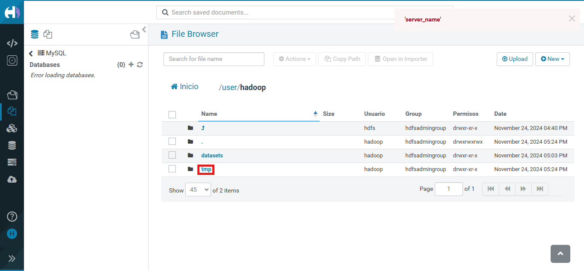

# Lab Map Reduce

## 1. Map Reduce
MapReduce es un modelo de programación para procesar grandes volúmenes de datos de forma distribuida. Se divide en dos fases:

Map: Procesa los datos y genera pares clave-valor.
Reduce: Agrupa los pares por clave y los procesa para obtener el resultado final.

Es eficiente, escalable y permite el procesamiento en paralelo en clústeres de computadoras.

## 2. Implementación
Se hizo los pasos establecidos en la [guía.](https://github.com/st0263eafit/st0263-242/tree/main/bigdata/02-mapreduce)

### 2.1. De Bucket a Hadoop

Como ya se cargo los datos en el bucket *sboterodatasets* y ya quedan guardados, con el siguiente comando pasamos los datos a Hadoop otra vez.

```bash
hadoop distcp s3a://sboterodatasets/ hdfs:///user/hadoop/datasets/
```



### 2.2 Contar palabras en local
Desde la carpeta *02-mapreduce* se ejecute el siguiente comando:

```bash
python wordcount-mr.py /home/hadoop/st0263-242/bigdata/datasets/gutenberg-small/*.txt > local_count.txt
```
El resultado se puede observar en el archivo [local_count.txt](local_count.txt)

### 2.3. Contar palabras en Hadoop
Desde la carpeta *02-mapreduce* se ejecute el siguiente comando:

```bash
python wordcount-mr.py hdfs:///user/hadoop/datasets/gutenberg-small/*.txt -r hadoop --output-dir hdfs:///user/hadoop/result3 --hadoop-streaming-jar $HADOOP_STREAMING_HOME/hadoop-streaming.jar
```

Se crea la carpeta *temp*:

